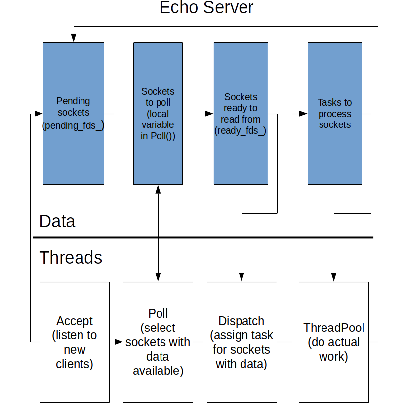

## Data flow
The server manages a couple of data structures with socket descriptors to optimize request processing:
* *EchoServer::pending_fds_*: list that accumulates newly created sockets and sockets which were just read from. It is unknown whether data can be read from these sockets without blocking.
* *fds* (local variable in EchoServer::Poll()): contiguous array of pollfd structures to pass it to poll system call and select those sockets which may be read without blocking.
* *EchoServer::ready_fds_*: list of sockets which may be read without blocking.
* *ThreadPool::tasks_*: queue of tasks to send client messages back.

Moving sockets between a pair of containers is accomplished by a dedicated thread:
* *Accept* thread accepts a new connection and put corresponding descriptor in the *EchoServer::pending_fds_*.
* *Poll* thread moves descriptors from *EchoServer::pending_fds_* to *fds*, calls *poll()* on them and extracts to *EchoServer::ready_fds_* descriptors which may be read without blocking.
* *Dispatch* thread puts task in the *ThreadPool::tasks_* for each descriptor in the *EchoServer::ready_fds_*

## Pros and cons
It seems that this number of containers is redundant but these containers serve as buffers and allow to reduce time of synchronized access. The server uses a bunch of dedicated threads to send client messages back so clients can be served simultaneously. These threads process only socket with data available for reading so they can only block on the *write* operation. The cost of it is repetitive switching of sockets which doesn't look effective in some cases.